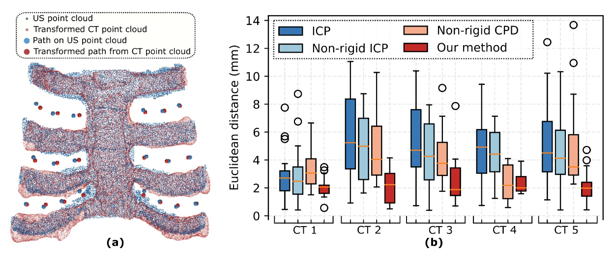

# Thoracic Cartilage Graph-based Ultrasound-CT Registration in Robotic Sonography

\* This work has been submitted to International Conference on Intelligent Robots and Systems 2023 (*IROS2023*).

## Abstract

Autonomous ultrasound (US) imaging has gained increased interest recently, and it has been seen as a potential solution to overcome the limitations of free-hand US examinations, such as inter-operator variations. However, it is still challenging to accurately map planned paths from a generic atlas to individual patients, particularly for thoracic applications with high acoustic-impedance bone structures under the skin. To address this challenge, a graph-based non-rigid registration is proposed to enable transferring planned paths from the atlas to the current setup by explicitly considering subcutaneous bone surface features instead of the skin surface. To this end, the sternum and cartilage branches are segmented using a template matching to assist coarse alignment of US and CT point clouds. Afterward, a directed graph is generated based on the CT template. Then, the self-organizing map using geographical distance is successively performed twice to extract the optimal graph representations for CT and US point clouds, individually. To evaluate the proposed approach, five cartilage point clouds from distinct patients are employed. The results demonstrate that the proposed graph-based registration can effectively map trajectories from CT to the current setup for displaying US views through limited intercostal space. The non-rigid registration results in terms of Hausdorff distance (Mean±SD) is 9.48±0.27 mm and the path transferring error in terms of Euclidean distance is 2.21 ± 1.11 mm.

## Performance

Performance of scanning paths transferring from CT to US space on five distinct CT images.

(a) Illustration of the results of 20 waypoints distributed in all intercostal spaces mapped from CT to US.

(b) The statistical results of the mapping performance in terms of position error.

## Documents Structure

- `conda-env.yaml`: create python environment with command `conda env create -f conda-env.yaml`
- `segmentation.py`: codes related to coarse registration
- `registration.py`: codes related to fine registration
- `pipeline.py`: codes that conpact codes in the above listed files in high level.
- `example.ipynb`: an example of how the codes work
